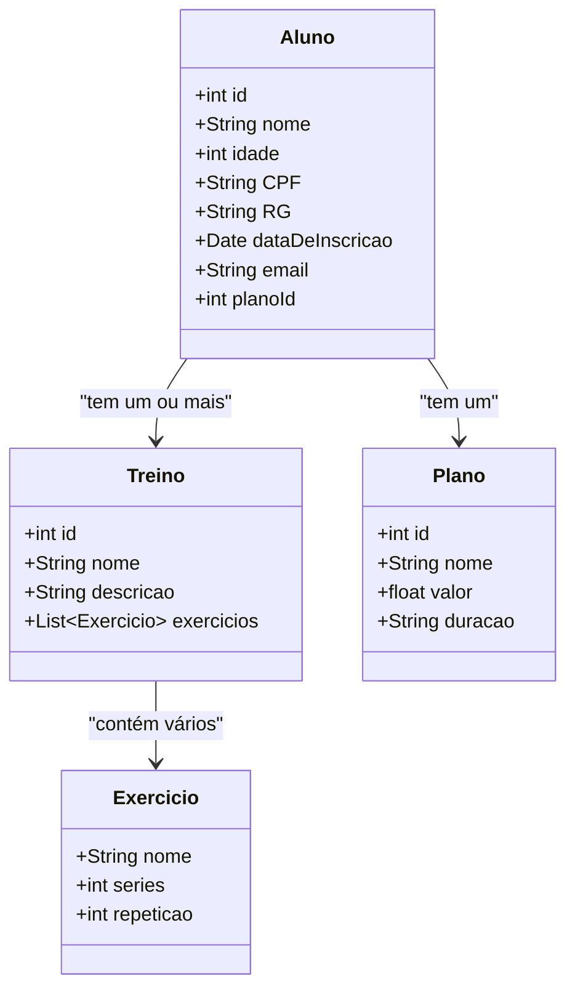

# API
Java RESTful API 

## Diagrama de classes

```mermaid
classDiagram
    class Aluno {
        +int id
        +String nome
        +int idade
        +String CPF
        +String RG
        +Date dataDeInscricao
        +String email
        +int planoId
    }

    class Treino {
        +int id
        +String nome
        +String descricao
        +List~Exercicio~ exercicios
    }

    class Exercicio {
        +String nome
        +int series
        +int repeticao
    }

    class Plano {
        +int id
        +String nome
        +float valor
        +String duracao
    }

    %% Definindo associações
    Aluno --> Plano : "tem um"
    Treino --> Exercicio : "contém vários"
    Aluno --> Treino : "tem um ou mais"
```
